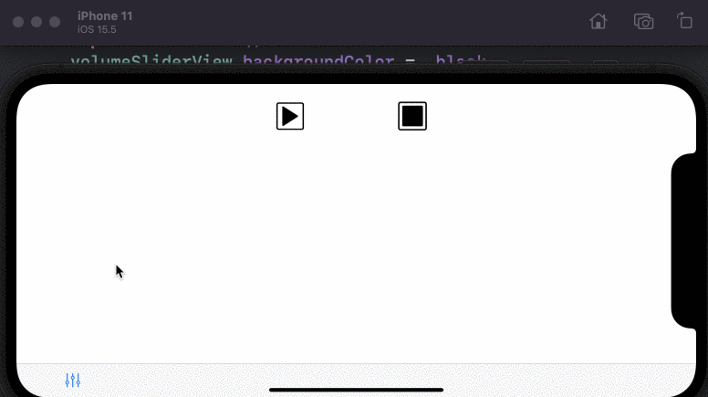
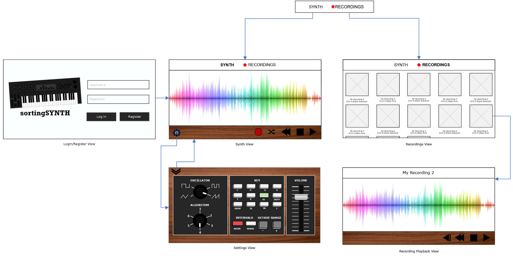

# Group 12: SortingSynth

## Table of Contents
1. [Overview](#Overview)
1. [Product Spec](#Product-Spec)
1. [Wireframes](#Wireframes)
2. [Schema](#Schema)

## Overview
### Description
An iOS synthesizer that uses a variety of sorting algorithms to generate sound patterns.

### App Evaluation
- **Category:** Music / Education
- **Mobile:** This app will be primarily developed for mobile
- **Story:** Takes a random array of integers and sorts them. For each sort, it generates a synthesized tone. For each synthsized tone, it is matched to a musical key signature, including 12-tone chromatic scale. The user can adjust different settings to change the sound.
- **Market:** This turns the iPhone into a musical instrument. Any musician could use this to create sounds. 
- **Habit:** This is intentionally designed to not be a social application. The user will be able to share their recordings/generated sounds. 
- **Scope:** This is an instrument, it's sounds can be directly output from the iphone to a device that receives audio input. The recording can be shared to various socials or directly downloaded to the device to be sampled later.

## Product Spec

### 1. User Stories (Required and Optional)

**Required Must-have Stories**

1) [x] User can register
2) [x] User can log in
3) [x] User can change volume


4) [x] User can change oscillator



5) [ ] User can +/- octaves
6) [ ] User can select musical keys
7) [ ] User can change sorting algorithm
8) [x] User can start/stop the synthesizer


**Optional Nice-to-have Stories**

1) [x] User can save a recording
  
2) [ ] User can add effects
3) [ ] User can "share" a recording
4) [ ] User can direct download the recording

### 2. Screen Archetypes

* Login
* Register
   * Upon Download/Reopening of the application, the user is prompted to log in to gain access to their recordings
* Synth Screen
    * User can generate sounds on this screen
    * User has a transport controls available to control playback and initiate record
* Recordings
    * User can save recordings played from synth screen to cloud storage
* Settings
    * User can change oscillator type, musical key signature, speed, octave range (array size), and other settings.
 

### 3. Navigation

**Tab Navigation** (Tab to Screen)

* Synth
* Recordings

**Flow Navigation** (Screen to Screen)

* Forced Log-in -> Account creation if no log in is available
* Synth Screen -> Jumps to settings
* Settings -> Toggle settings
* Recordings -> Replay recordings and share -> Jumps to modal iOS share screen


## Wireframes



## Schema 
### Models

#### Users Data Model Table 
| Property | Type     | Description|
| -------- | -------- | -------- |
| objectId | String   | unique id for the user (default field)|
| username  | String   | image author|
| password | String   | image that user posts|
| createdAt| Date     | date when user registered|


#### Recordings Data Model Table 
| Property | Type     | Description|
| -------- | -------- | --------   |
| objectId | String   | unique id for the recording (default field)|
| file     | File     | wav file of synth recording|
| createdAt| Date     | date when recording was created|
| author   | Pointer to User| user who created recording|
| title    | String   | name that user gave recording|


### Networking
#### List of network requests by screen      
  - Login Screen
      - (Read/GET) Validate user credentials
        ```swift
         // Send a request to login
        PFUser.logInWithUsernameInBackground(username, password: password, block: { (user, error) -> Void in           
            
            if ((user) != nil) {
                var alert = UIAlertView(title: "Success", message: "Logged In", delegate: self, cancelButtonTitle: "OK")
                alert.show()
                
                dispatch_async(dispatch_get_main_queue(), { () -> Void in
                    let viewController:UIViewController = UIStoryboard(name: "Main", bundle: nil).instantiateViewControllerWithIdentifier("Home") as! UIViewController
                    self.presentViewController(viewController, animated: true, completion: nil)
                })
                
            } else {
                var alert = UIAlertView(title: "Error", message: "\(error)", delegate: self, cancelButtonTitle: "OK")
                alert.show()
            }
        })
        ```
      - (Create/POST) Create new user 
        ```swift
        // Sign up the user asynchronously
        newUser.signUpInBackgroundWithBlock({ (succeed, error) -> Void in
            if ((error) != nil) {
                var alert = UIAlertView(title: "Error", message: "\(error)", delegate: self, cancelButtonTitle: "OK")
                alert.show()
                
            } else {
                var alert = UIAlertView(title: "Success", message: "Signed Up", delegate: self, cancelButtonTitle: "OK")
                alert.show()
                dispatch_async(dispatch_get_main_queue(), { () -> Void in
                    let viewController:UIViewController = UIStoryboard(name: "Main", bundle: nil).instantiateViewControllerWithIdentifier("Home") as! UIViewController
                    self.presentViewController(viewController, animated: true, completion: nil)
                })
            }
        })
        ```
  - Synth Screen
      - (Create/POST) Create new recording
        ```swift
        let path = fileName
        let filePath = NSURL(fileURLWith Path: path)
        var dataToUpload : NSData = NSData(contentsOfURL: filePath!)!
        let soundFile = PFFile(name: fileNAme, data: dataToUpload)
        var userSound = PFObject(className:"upload")
        userSound["user"] = currentUser
        userSound["sound"] = soundFile
        userSound.saveInBackground()
        ```
  - Recordings Screen
      - (Read/GET) Query all recordings where current user is the author
        ```swift
        let currentRecording = recordings["recordingFile"] as PFFileObject
        let recordingData = currentRecording.getData()
        ```
      - (Update/POST) Update/Rename recording
        ```swift
        let query = PFQuery(className:"Recordings")
        query.getObjectInBackground(withId: objectID) { (recording: PFObject?, error: Error?) in 
        if let error = error { print(error.localizedDescription)} 
            else if let recording = recording {
                recording["title"] = "New Title"
                recording.saveInBackground()
            }                                                                               
        }
        ```
      - (Delete) Delete existing recording
        ```swift
        let request = NSMutableURLRequest(URL: NSURL(string: "https://api.parse.com/1/files/recordings\(currentuser.objectId).wav")!)
        request.HTTPMethod = "DELETE"
        request.setValue(appId, forHTTPHEaderField: "X-Parse-Application-Id")
        request.setValue(clientKey, forHTTPHEaderField: "X-Parse-Master-Key")
        let task = NSURLSession.sharedSession().dataTaskWithRequest(request,completionHandler: {data, response, error -> Void in print("Response: \(response)")})
        task!.resume()
        ```

## Video Walkthrough

Here's a walkthrough of implemented user stories:


